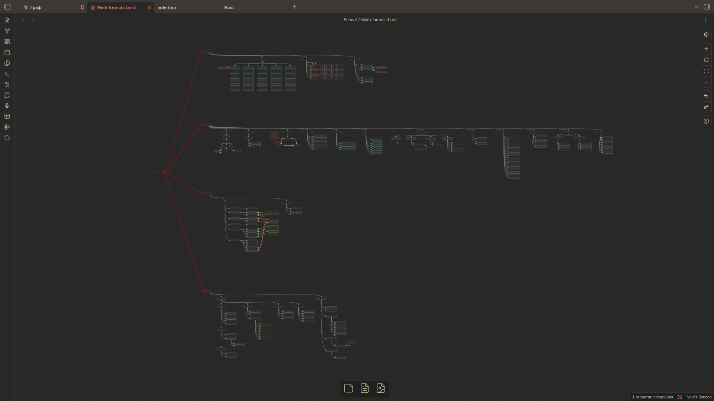
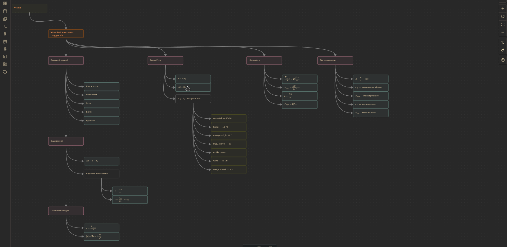

## 📐 Math & Physics Cheatsheet

> Шпаргалка у форматі .canvas для Obsidian у зручному компонуванні з використанням кольорів, стрілок та **LaTeX** форматування.

### 🗂️ Що всередині

- Алгебра
- Геометрія /  Тригонометрія
- Фізика

---

### 🚀 Використання

> Завантажити файл і відкрити з сховища у [Obsidian](https://obsidian.md/).

---

### 🔄 Оновлення

> Файл оновлюється, час від часу додаються нові розділи і формули. Слідкуй за змінами через **Star** та **Commits** репозиторію.

---

### 💡 Пропозиції

> Є ідеї які формули або розділи додати? Пиши у розділі **Discussions**.

---

### Приклади структури

------
© Undercat037 — [CC BY-NC 4.0](https://creativecommons.org/licenses/by-nc/4.0/). Некомерційне використання дозволено.
